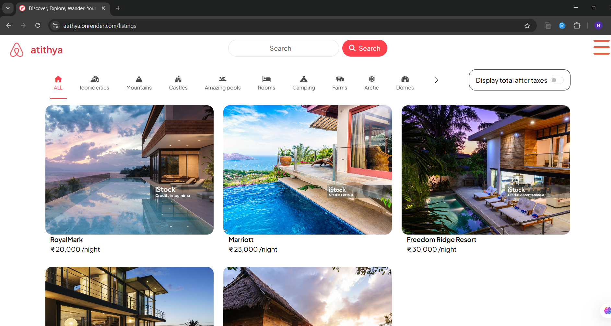

# Atithya

A curated hospitality service platform built with the MERN stack, designed to simplify guest management and deliver seamless, immersive experiences for both users and hosts. It includes user authentication, image uploads, and secure session management—all within a clean, modern UI.



## 🚀 Live Project

Check out the live project: [Atithya on Render](https://atithya.onrender.com)

## 🛠️ Technologies Used

- **Node.js** – JavaScript runtime for server-side development
- **Express.js** – Lightweight web framework for building APIs
- **MongoDB Atlas** – Cloud-based MongoDB database service
- **Mongoose** – ODM for MongoDB and Node.js
- **MERN Stack** (MongoDB, Express.js, React.js, Node.js)
- **EJS** – Templating engine for rendering dynamic HTML
- **Multer** – Middleware for handling file/image uploads
- **Cloudinary** – Image hosting and transformation API
- **Express-session** – Session management for Node.js apps
- **Connect-mongo** – Store sessions in MongoDB
- **Passport.js** – Middleware for user authentication
- **Bootstrap** – Responsive UI styling framework
- **Dotenv** – Environment variable management
- **Render** – Cloud platform for deployment

## ✨ Key Features

- **User Authentication**: Register, login, and logout securely.
- **Image Upload**: Upload property or room images using Multer and Cloudinary.
- **Session Management**: Securely manage user sessions with MongoDB store.
- **Dynamic Rendering**: EJS-based views for a fast and server-side rendered UI.
- **Error Handling**: Custom error pages and user-friendly feedback.
- **Hosting Ready**: Easily deployable to Render or any cloud platform.

## 🚀 Getting Started

To run this project locally:

1. Clone the repository:

    ```bash
    git clone https://github.com/im-h-a-r-s-h/Atithya.git
    cd Atithya
    ```

2. Install dependencies:

    ```bash
    npm install
    ```

3. Configure environment variables:

    Create a `.env` file in the root directory and add your configuration like:

    ```env
    MONGO_URI=your-mongodb-atlas-connection-string
    CLOUDINARY_CLOUD_NAME=your-cloud-name
    CLOUDINARY_API_KEY=your-api-key
    CLOUDINARY_API_SECRET=your-api-secret
    SESSION_SECRET=your-session-secret
    ```

4. Run the application:

    ```bash
    node app.js
    ```

Visit [http://localhost:3000](http://localhost:3000) in your browser to explore Atithya locally.

## 🙏 Acknowledgements

Special thanks to **Shraddha Dii** for her invaluable guidance, encouragement, and insights throughout the development of this project. Her support played a key role in shaping Atithya and making it placement-ready.

## Contribution
Feel free to contribute to this project by opening issues or creating pull requests. Your feedback and contributions are highly appreciated!

